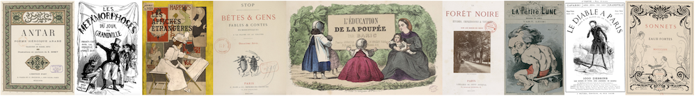

# Présentation

Luce Abélès nous a quittés en 2015. Longtemps rattachée au Musée d’Orsay, c’est en organisant de nombreuses expositions mettant en lumière les relations entre les écrivains et les artistes (autour de Manet, de Champfleury, de la bohème montmartroise…) qu’elle entama un travail de recherche de longue haleine consacré au livre illustré. La bibliographie de ses travaux témoigne de l’ampleur de ses connaissances dans tous les aspects de la culture du beau livre au XIXe siècle : sociologie, bibliographie matérielle, histoire de l’art, de la littérature, de la presse, des techniques y sont convoquées dans une vaste entreprise d’exploration de l’histoire des rapports entre les textes et les images.

La passion de Luce était communicative. La matérialité des livres, leurs méthodes de production, les détails techniques de leur fabrication n’avaient pas de secret pour elle, et elle savait transmettre à ses lecteurs sa fascination pour la genèse des ouvrages illustrés. Par-delà l’émoi esthétique provoqué par ces objets artistiques, elle était capable de dégager patiemment, en archéologue bibliophile, toutes les strates historiques emmagasinées dans ces livres pour en rehausser encore l’intérêt. Elle exhumait les discussions entre éditeurs et auteurs, les contraintes matérielles, les choix de papier, de caractères typographiques, de techniques de reproduction des images, les expérimentations de mise en page et d’encrage : la création bibliophilique faisait l’objet d’une enquête policière dont elle nous faisait partager les découvertes. Elle ne reculait devant aucun défi, dépouillant correspondances, archives d’éditeurs et autres fonds ésotériques pour comprendre les étapes qui avaient permis d’incarner un désir de beauté dans l’écrin d’une reliure précieuse. Échappant aux coffres des collectionneurs, aux fonds précieux des bibliothèques, aux vitrines des salles d’exposition, les livres redevenaient des objets vivants, les concrétisations sensibles de traditions, de savoir-faire, de débats et de quêtes esthétiques exaltées.

Parmi les nombreux dossiers qui synthétisaient ces recherches, elle avait entrepris une base de données réunissant tous les ouvrages illustrés publiés au tournant des XIXe et XXe siècles, véritable âge d’or du livre de luxe qui voit le renouvellement des formes anciennes de la bibliophilie grâce aux innovations tentées par des imprimeurs (Gillot, Lahure), des éditeurs (Lesclide, Pelletan, Vanier, Piazza, Quantin), des amateurs d’art (Uzanne, Carteret, les sociétés de bibliophiles), des revues (éditions de *La Plume*, de *La Revue blanche*, du *Mercure de France*), des galeristes (Vollard, Sagot). Sa famille nous a confié cette base pour la mettre à disposition du public, afin que ses travaux continuent à susciter des vocations et à aider les chercheurs en histoire de l’imprimé.

Cette base de données répertorie plus de 5500 ouvrages illustrés publiés entre 1839 et 1944. Chaque entrée a fait l’objet d’une description minutieuse de tous les aspects matériels de ces éditions : techniques utilisées, nombre et types d’illustration, tirage, imprimeur des estampes, prix de vente, date de parution des livraisons, papier, références bibliographiques (catalogues d’éditeurs, manuels de bibliophilie), présentation à des expositions... La base se distingue en outre d’autres bibliographies en réservant une entrée par exemplaire des ouvrages décrits. La provenance de chaque exemplaire, ses particularités (envois, insertion de lettres autographes, ajouts manuscrits, rehauts à l’aquarelle), sa localisation actuelle sont indiquées de manière systématique.

Nous tenons encore à remercier Marc et Judith Bormand pour la confiance qu’ils nous ont témoignée en nous permettant de mettre en ligne cet outil inestimable pour la communauté des chercheurs et des amateurs de beaux livres.
